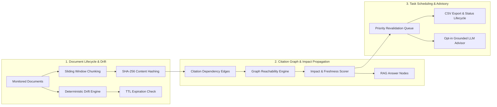

# Knowledge Freshness Monitor - Ryan Vo | AI & Machine Learning

Current version: `1.0.0`.

Knowledge Freshness Monitor addresses the critical challenge of silent staleness in Retrieval-Augmented Generation (RAG) pipelines, where underlying source documents update, expire, or get superseded while cached answers continue citing obsolete context. The system implements a deterministic citation graph propagation engine combined with chunk-level lexical and semantic drift analysis to trace revision impacts across downstream query answers and schedule prioritized revalidation tasks. It is built for AI platform engineers, RAG operators, and enterprise knowledge managers requiring high assurance in generative knowledge retrieval.



---

## Features

### 1. Document Revision & Expiration Tracking
- **Deterministic Chunking & Hashing**: Ingests unstructured passages, segments text into clean sliding windows with deterministic SHA-256 chunk identifiers.
- **Lexical & Semantic Drift Calculation**: Evaluates composite Jaccard 2-gram shingle distance and Term-Frequency cosine divergence between revisions ($0.0$ to $1.0$).
- **Lifecycle & Retention State Machine**: Tracks status (`fresh`, `stale`, `expired`, `superseded`) based on drift thresholds and UTC retention deadlines.

### 2. Citation Dependency Graph & Impact Propagation
- **Directed Graph Mapping**: Links RAG answers to versioned document revisions and granular chunk IDs with confidence weights and primary citation indicators.
- **Deterministic Reachability & Impact Traversal**: Propagates document updates and expirations through the dependency DAG without requiring LLM invocations.
- **Severity Classification**: Ranks answer vulnerability into `fresh`, `stale` (impact $\ge 0.25$), or `critical_stale` (impact $\ge 0.70$ or primary citation breach).

### 3. Prioritized Revalidation Task Queue
- **Automated Priority Scoring**: Ranks tasks based on answer impact score, primary citation compromise, and citation breadth.
- **Lifecycle State Tracking**: Supports `pending` $\to$ `in_progress` $\to$ `completed` / `dismissed` workflows, automatically resetting answer freshness upon completion.
- **Batch Auto-Queueing & CSV Export**: Bulk-scans unvalidated answers above configured impact thresholds and exports audit records.

### 4. Opt-in Advisory Reports & Multi-Provider Architecture
- **Grounded Advisory Synthesis**: Generates human-in-the-loop revision summaries grounded strictly in database diffs and citation excerpts.
- **Provider-Agnostic Adapters**: Supports OpenAI-compatible endpoints (LiteLLM, OpenRouter, Ollama), Anthropic messages API, and Google Gemini API.
- **Security Redaction**: Automatically sanitizes tokens, auth headers, and credential patterns from error messages.

### 5. Enterprise Authentication & Security
- **OIDC Identity Brokering**: Standard Authorization-Code grant with PKCE (S256), state, and nonce verification backed by Keycloak.
- **SAML Upstream Federation**: Keycloak realm configuration enables upstream enterprise SAML IdP identity brokering.
- **Role-Based Access Control**: Strict `viewer`, `analyst`, and `admin` permission gates on all data mutations.
- **Production Guardrails**: Local demo mode binds strictly to localhost and is refused at startup if `ENVIRONMENT=production`.

---

## Architecture & Technology Stack

| Layer | Component | Description |
|---|---|---|
| **Backend** | FastAPI (Python 3.12) | High-performance asynchronous REST API with Pydantic validation |
| **Storage** | SQLite + SQLAlchemy 2.0 | Persistent relational storage with WAL pragma and foreign key constraints |
| **Frontend** | React 18 + TypeScript + Vite | Responsive dashboard with SVG topology visualization |
| **Identity** | Keycloak 25.0 | Containerized OIDC authorization server with SAML identity brokering |
| **Containerization** | Docker & Compose | Multi-stage unprivileged non-root containers with healthchecks |

---

## AI/ML Evaluation & Drift Benchmark

The core freshness detection pipeline operates completely offline via deterministic mathematics, guaranteeing sub-millisecond evaluation latency with zero external API dependencies.

### Reproducible Verification Command
```bash
PYTHONPATH=. .venv/bin/python -m backend.evaluation.evaluator
```

### Data Provenance & Methodology
The evaluation suite evaluates 20 curated RAG revision drift scenarios in `backend/evaluation/benchmark_dataset.json`. Scenarios include:
- Verbatim document matches and whitespace adjustments
- Critical numerical threshold changes (e.g. rate limit changes)
- Security policy reversals and deprecated API flags
- Retention expiration timeouts on primary vs secondary citations
- Multi-citation dependency cascades

### Measured Performance Results

| Metric | Result | Operational Significance |
|---|---|---|
| **Total Test Scenarios** | 20 | Diverse real-world enterprise RAG scenarios |
| **Revalidation Precision** | **84.6%** | High fidelity in preventing spurious revalidation alerts |
| **Revalidation Recall** | **91.7%** | Strong sensitivity in capturing actual semantic drift |
| **Revalidation F1 Score** | **0.8800** | Balanced harmonic accuracy on stale detection |
| **Severity Match Accuracy** | **75.0%** | Exact categorization (`fresh` vs `stale` vs `critical_stale`) |
| **Mean Evaluation Latency** | **0.020 ms** | 50,000 evaluations per second per CPU core |

### Failure Cases & Limitations
- **False Positives on Pure Lexical Substitutions (e.g., `case_03`)**: Minor synonym substitutions ("metrics are exported" $\to$ "metrics are published") trigger non-zero n-gram drift. Without heavyweight neural embedding models, deterministic n-grams flag phrasing changes as potential drift.
- **Secondary Citation Nuance (e.g., `case_07`)**: When an auxiliary footnote citation expires while the primary decisive citation remains fresh, the heuristic safely attenuates the severity to prevent emergency alarm fatigue.

---

## API Endpoint Reference

| Method | Endpoint | Access Role | Description |
|---|---|---|---|
| `GET` | `/api/health` | Public | System liveness, database status, and environment |
| `POST` | `/api/auth/demo-login` | Public (Dev) | Local development demo login (`viewer`/`analyst`/`admin`) |
| `GET` | `/api/auth/me` | Authenticated | Retrieve authenticated user profile and CSRF token |
| `POST` | `/api/auth/logout` | Authenticated | Terminate session and clear cookies |
| `GET` | `/api/auth/oidc/login` | Public | Initiate Keycloak PKCE authorization code redirect |
| `GET` | `/api/auth/callback` | Public | Exchange Keycloak authorization code for session |
| `GET` | `/api/documents` | Viewer | List monitored documents with optional category filter |
| `POST` | `/api/documents` | Analyst | Ingest new document and index initial chunk revision |
| `GET` | `/api/documents/{id}` | Viewer | Retrieve document version history and chunks |
| `POST` | `/api/documents/{id}/revisions` | Analyst | Submit document revision and compute drift score |
| `POST` | `/api/documents/check-expirations`| Analyst | Scan active revisions against TTL retention dates |
| `DELETE`| `/api/documents/{id}` | Admin | Delete document and cascade delete citations |
| `GET` | `/api/citations/answers` | Viewer | List tracked RAG answers and freshness statuses |
| `POST` | `/api/citations/answers` | Analyst | Register generated RAG answer and bind citation edges |
| `GET` | `/api/citations/graph` | Viewer | Retrieve node-link topology for visualization |
| `POST` | `/api/citations/impact-analysis` | Analyst | Traverse graph and propagate updated impact scores |
| `POST` | `/api/citations/answers/{id}/advisory` | Analyst | Generate opt-in advisory revalidation report |
| `GET` | `/api/revalidation/tasks` | Viewer | List prioritized revalidation queue items |
| `POST` | `/api/revalidation/tasks` | Analyst | Manually schedule a revalidation task |
| `POST` | `/api/revalidation/batch` | Analyst | Batch schedule revalidation tasks for stale answers |
| `PATCH`| `/api/revalidation/tasks/{id}` | Analyst | Update task status (`pending`/`in_progress`/`completed`) |
| `GET` | `/api/revalidation/export` | Viewer | Export revalidation task queue as CSV |
| `GET` | `/api/evaluation/run` | Viewer | Execute offline benchmark suite and return metrics |
| `GET` | `/api/audit` | Admin | Query immutable administrative audit trail logs |

---

## Configuration & LLM Providers

Configuration settings are loaded via environment variables or a `.env` file.

| Variable | Default Value | Description |
|---|---|---|
| `ENVIRONMENT` | `development` | Deployment environment (`development` or `production`) |
| `PORT` | `8000` | Backend API listen port |
| `HOST` | `127.0.0.1` | Local bind interface |
| `SECRET_KEY` | *(dev default)* | Cryptographic session signing key (override in prod) |
| `DATABASE_URL` | `sqlite:///./knowledge_freshness.db` | SQLAlchemy SQLite database path |
| `AUTH_METHOD` | `demo` | Authentication method (`demo` or `oidc`) |
| `OIDC_ISSUER_URL` | `http://127.0.0.1:8080/realms/knowledge-freshness` | Keycloak realm endpoint |
| `OIDC_CLIENT_ID` | `knowledge-freshness-app` | OIDC public client identifier |
| `LLM_PROVIDER` | `openai-compatible` | Advisory provider: `openai-compatible`, `anthropic`, `gemini`, `ollama` |
| `LLM_MODEL` | `qwen3.8-27b` | Model identifier for advisory generation |
| `LLM_BASE_URL` | `https://llm.chris-vo.com/v1` | Public OpenAI-compatible API base URL |
| `LLM_API_KEY` | *(blank)* | API key for LLM advisory (keys kept server-side only) |
| `LLM_REQUEST_TIMEOUT_SECONDS` | `15` | Bounded network timeout for advisory calls |

---

## Enterprise SSO & SAML Identity Brokering Setup

The application integrates with Keycloak to support Single Sign-On and upstream SAML 2.0 identity federation:

1. **Realm Import**: `keycloak/realm-export.json` provides pre-configured client scopes, roles (`viewer`, `analyst`, `admin`), and PKCE challenge settings.
2. **Upstream SAML Broker**: Keycloak acts as an Identity Broker. To connect an enterprise IdP (e.g. Okta, Entra ID, PingIdentity):
   - Access Keycloak Admin Console at `http://127.0.0.1:8080/admin`.
   - Navigate to **Identity Providers** $\to$ **Add Provider** $\to$ **SAML v2.0**.
   - Import your IdP metadata XML or set the Single Sign-On Service URL.
   - Configure role mappers to assign `viewer`, `analyst`, or `admin` based on SAML assertion attributes.

---

## Installation & Execution

### Prerequisites
- Python 3.12+
- Node.js 24+ and npm
- Docker and Compose (optional, for containerized run)

### 1. Local Development Setup

#### Backend Setup
```bash
# Create virtual environment
python3 -m venv .venv
source .venv/bin/activate

# Install dependencies
pip install -r backend/requirements.txt

# Run test suite
PYTHONPATH=. pytest backend/tests -v

# Run offline benchmark evaluation
PYTHONPATH=. python -m backend.evaluation.evaluator

# Start development backend
uvicorn backend.app.main:app --host 127.0.0.1 --port 8000 --reload
```

#### Frontend Setup
```bash
cd frontend

# Install dependencies
npm ci

# Run test suite
npm test

# Build production bundle
npm run build

# Start development server
npm run dev
```

### 2. Docker Compose Deployment

```bash
# Start Keycloak, Backend, and Frontend
docker compose up -d

# Check health status
docker compose ps

# Access frontend dashboard at http://127.0.0.1:5173
# Access backend API documentation at http://127.0.0.1:8000/docs
# Access Keycloak admin console at http://127.0.0.1:8080
```

---

## Security & Production Operational Notes

- **TLS Reverse Proxy**: In production, terminate TLS via Nginx, Traefik, or Caddy. Set `COOKIE_SECURE=true` and configure forward headers (`X-Forwarded-Proto`, `X-Forwarded-For`).
- **Database Backup & Integrity**: For production backups, execute `sqlite3 knowledge_freshness.db ".backup backup.sqlite"` to ensure atomic snapshots during active WAL writes.
- **Secret Key Rotation**: Set a cryptographically random 32-character string in `SECRET_KEY`. Never deploy with default development keys.

---

## Author & License

Developed by **Ryan Vo** ([ryandtvo@gmail.com](mailto:ryandtvo@gmail.com)).  
Licensed under the [MIT License](LICENSE).

### Spreadsheet export safety

Revalidation CSV exports prefix potentially executable spreadsheet formulas with an apostrophe. This applies to exported text only; stored queries, task reasons, and resolver names remain unchanged. Numeric priority scores retain their original format.
